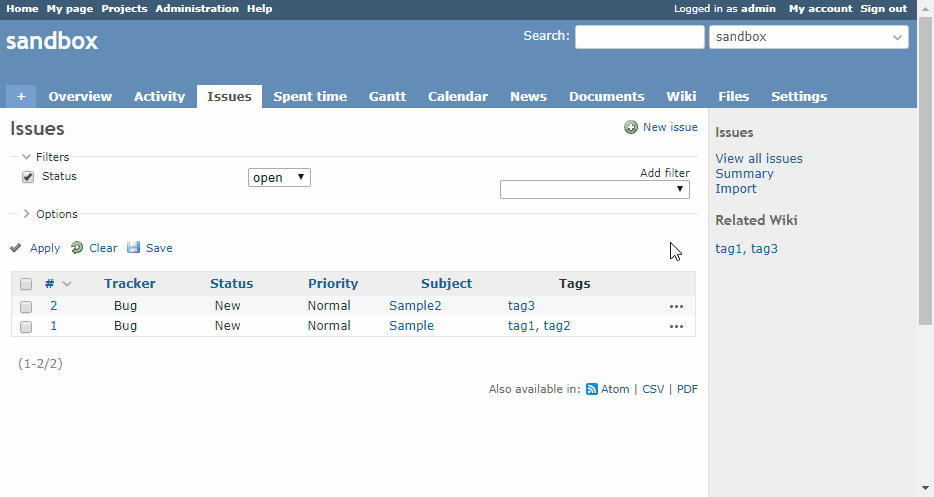

# Redmine Related Wiki Plug-in

This plug-in shows links to Wiki related to Issue in the sidebar.

Create links from the following items:

* Tags(Depends on [Redmine Tags plug-in](https://github.com/ixti/redmine_tags))

Only shows the existing Wikis in the issue list page,
 and also shows new Wiki page link in the issue detail page.



## Installation

1. Clone or copy files into the Redmine plugins directory
   ```
   git clone https://github.com/taikii/redmine_related_wiki.git plugins/redmine_related_wiki
   ```
2. Restart Redmine

## License

[MIT](LICENSE)
